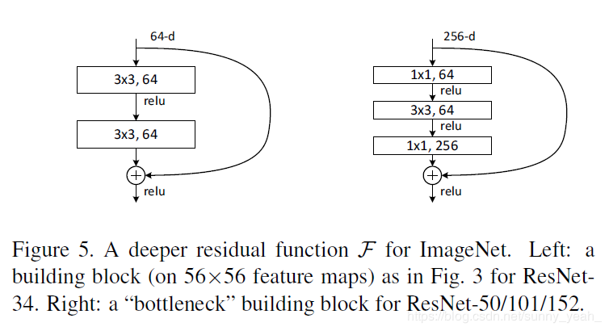

# ResNet

> 博客原文 <https://blog.csdn.net/sunny_yeah_/article/details/89430124>
>
> 作者：sunny_yeah_ <https://me.csdn.net/sunny_yeah_>

## 目录

1. 什么是 ResNet
2. 为什么要引入 ResNet
3. ResNet详细解说

> 论文地址：<https://arxiv.org/pdf/1512.03385.pdf>
>
> 改进版 ResNet：<https://arxiv.org/pdf/1603.05027.pdf>

## 什么是 ResNet

ResNet是一种残差网络，咱们可以把它理解为一个子网络，这个子网络经过堆叠可以构成一个很深的网络。咱们可以先简单看一下ResNet的结构，之后会对它的结构进行详细介绍。

那么可能会有小伙伴疑问，干嘛非要构建这么一个网络来堆叠出一个深层网络呢？干嘛不直接用卷积层对网络进行一个堆叠呢？

## 为什么要引入ResNet？

我们知道，网络越深，咱们能获取的信息越多，而且特征也越丰富。但是根据实验表明，随着网络的加深，优化效果反而越差，测试数据和训练数据的准确率反而降低了。**这是由于网络的加深会造成梯度爆炸和梯度消失的问题。**

目前针对这种现象已经有了解决的方法：*对输入数据和中间层的数据进行归一化操作，这种方法可以保证网络在反向传播中采用随机梯度下降（SGD），从而让网络达到收敛。* 但是，这个方法仅对几十层的网络有用，当网络再往深处走的时候，这种方法就无用武之地了。

为了让更深的网络也能训练出好的效果，何凯明大神提出了一个新的网络结构——ResNet。这个网络结构的想法主要源于 VLAD（残差的想法来源）和 [Highway Network](https://arxiv.org/pdf/1505.00387.pdf)（跳跃连接的想法来源）。

## ResNet详细解说

再放一遍ResNet结构图。要知道咱们要介绍的核心就是这个图啦！（ResNet block有两种，一种两层结构，一种三层结构）

咱们要求解的映射为：$H(x)$
现在咱们将这个问题转换为求解网络的残差映射函数，也就是 $F(x)$，其中 $F(x) = H(x)-x$。

> 残差：观测值与估计值之间的差。
>
> 这里H(x)就是观测值，x就是估计值（也就是上一层ResNet输出的特征映射）。
>
> 我们一般称x为identity Function，它是一个跳跃连接；称F(x)为ResNet Function。

那么咱们要求解的问题变成了 $H(x) = F(x)+x$。

> 有小伙伴可能会疑惑，咱们干嘛非要经过F(x)之后在求解H(x)啊！整这么麻烦干嘛！
>
> 咱们开始看图说话：如果是采用一般的卷积神经网络的化，原先咱们要求解的是H(x) = F(x)这个值对不？那么，我们现在假设，在我的网络达到某一个深度的时候，咱们的网络已经达到最优状态了，也就是说，此时的错误率是最低的时候，再往下加深网络的化就会出现退化问题（错误率上升的问题）。咱们现在要更新下一层网络的权值就会变得很麻烦，权值得是一个让下一层网络同样也是最优状态才行。对吧？
>
> 但是采用残差网络就能很好的解决这个问题。还是假设当前网络的深度能够使得错误率最低，如果继续增加咱们的ResNet，为了保证下一层的网络状态仍然是最优状态，咱们只需要把令F(x)=0就好啦！因为x是当前输出的最优解，为了让它成为下一层的最优解也就是希望咱们的输出H(x)=x的话，是不是只要让F(x)=0就行了？
>
> 当然上面提到的只是理想情况，咱们在真实测试的时候x肯定是很难达到最优的，但是总会有那么一个时刻它能够无限接近最优解。采用ResNet的话，也只用小小的更新F(x)部分的权重值就行啦！不用像一般的卷积层一样大动干戈！

现在大家已经理解了为啥只要用 $F(x)+x$ 来表示 $H(x)$ 了吧！

它的公式也相当简单（这里给出两层结构的）：$a^{[l+2]}=Relu(W^{[l+2]}(Relu(W^{[l+1]}a^{[l]}+b^{[l+1]})+b^{[l+2]}+a^{[l]})$

注意：如果残差映射(F(x))的结果的维度与跳跃连接(x)的维度不同，那咱们是没有办法对它们两个进行相加操作的，必须对x进行升维操作，让他俩的维度相同时才能计算。

### 升维的方法有两种：

- 全0填充；

- 采用1*1卷积。

最后的实验结果表明，ResNet在上百层都有很好的表现，但是当达到上千层了之后仍然会出现退化现象。不过在2016年的Paper中对ResNet的网络结构进行了调整，使得当网络达到上千层的时候仍然具有很好的表现。有兴趣的小伙伴可以自己瞅瞅论文。

***

## 补充内容

### 网络的深度为什么重要

因为CNN能够提取low/mid/high-level的特征，网络的层数越多，意味着能够提取到不同level的特征越丰富。并且，越深的网络提取的特征越抽象，越具有语义信息。

### 残差表示

    VALD，Fisher Vector都是是对残差向量编码来表示图像，在图像分类，检索表现出优于编码原始向量的性能。

    在low-level的视觉和计算机图形学中，为了求解偏微分方程，广泛使用的Multigrid方法将系统看成是不同尺度上的子问题。每个子问题负责一种更粗糙与更精细尺度的残差分辨率。Multigrid的一种替换方法是层次化的预处理，层次化的预处理依赖于两种尺度的残差向量表示。实验表明，这些求解器要比对残差不敏感的求解器收敛更快。

### shortcut连接

    shortcut连接被实验和研究了很久。Highway networks也使用了带有门函数的shortcut。但是这些门函数需要参数，而ResNet的shortcut不需要参数。而且当Highway networks的门函数的shortcut关闭时，相当于没有了残差函数，但是ResNet的shortcut一直保证学习残差函数。而且，当Highway networks的层数急剧增加时，没有表现出准确率的上升了。总之，ResNet可以看成是Highway networks的特例，但是从效果上来看，要比Highway networks好。

### 设计网络

    设计网络的规则：1.对于输出feature map大小相同的层，有相同数量的filters，即channel数相同；2. 当feature map大小减半时（池化），filters数量翻倍。

    对于残差网络，维度匹配的shortcut连接为实线，反之为虚线。维度不匹配时，同等映射有两种可选方案：

    直接通过zero padding 来增加维度（channel）。
    乘以W矩阵投影到新的空间。实现是用1x1卷积实现的，直接改变1x1卷积的filters数目。这种会增加参数。

### trick

    训练测试的multi-scale，BN，color augmentation. 测试时的10-cut.

### **最后作者把ResNet用到了其他比赛上，拿了很多冠军...**

## 网络结构

卷积层大多数具有3×3滤波器，并遵循两个简单的设计规则：（i）对于相同的输出特征图大小，这些层具有相同的过滤器数量； （ii）如果特征图的大小减半，则过滤器的数量将增加一倍，以保持每层的时间复杂度。

我们直接通过步长为2的卷积层执行下采样。网络结束时会出现一个全局平均池化层和一个1000连通层以及softmax。

## Deeper Bottleneck Architecture

### Bottleneck:

右图为Bottleneck，对于每个残差函数 F，使用 3 层堆栈结构。这三个层分别是 $1 \times 1$ 、 $3 \times 3$ 、 $1 \times 1$ 卷积。其中 $1 \times 1$ 层负责减小然后增加（还原）尺寸，从而使 $3 \times 3$ 层成为输入、输出尺寸较小的 bottleneck。上图两个设计都具有相似的时间复杂度。

### 50-layer ResNet

