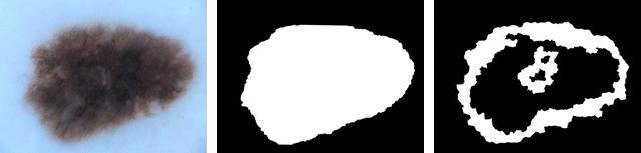
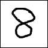
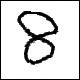
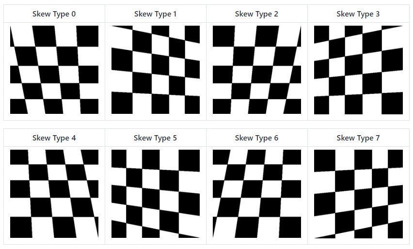
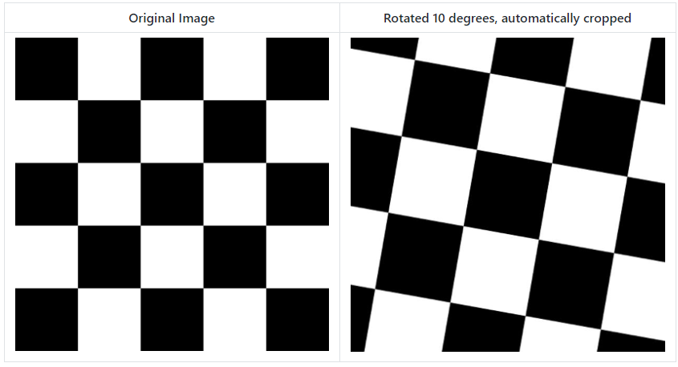
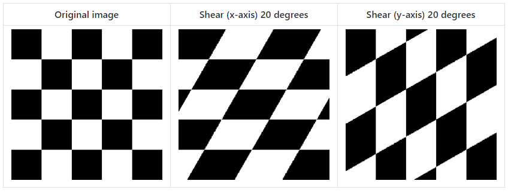
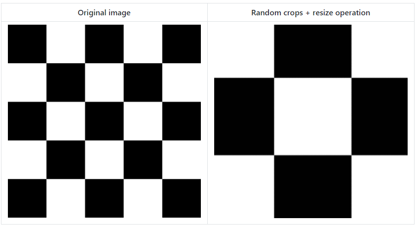
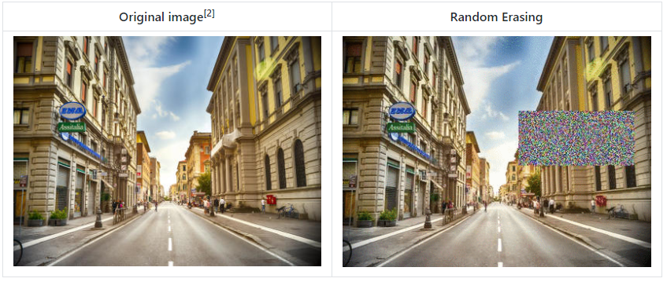

# Augmentor

Augmentor的目的是自动化图像增强（人工数据生成），以扩展数据集作为机器学习算法（尤其是神经网络和深度学习）的输入。

该程序包通过构建augmentation pipeline来工作，您可以在其中定义要对一组图像执行的一系列操作。 诸如旋转或变换之类的操作被逐一添加以创建扩充流水线：完成后，可以执行流水线并创建扩充数据集。

## 代码

```python
import Augmentor

p = Augmentor.Pipeline("/home/user/augmentor_data_tests")

p.rotate90(probability=0.5)
p.rotate270(probability=0.5)
p.flip_left_right(probability=0.8)
p.flip_top_bottom(probability=0.3)
p.crop_random(probability=1, percentage_area=0.5)
p.resize(probability=1.0, width=120, height=120)

p.sample(100)
```

```python
# 透视倾斜
skew_tilt()
skew_left_right()
skew_top_bottom()
skew_corner()
skew()

# 弹性变形
random_distortion()

# 旋转
rotate()
rotate90()
rotate180()
rotate270()
rotate_random_90()
# 任意的非模90度旋转将不幸地导致图像填充在每个角上。 为减轻这种情况，Augmentor的默认行为是裁剪图像并尽可能保留最大裁剪量，同时保持图像的长宽比。

# 剪切变形
shear()

# 裁剪
crop_centre()
crop_by_size()
crop_random()

# 镜像
flip_left_right()
flip_top_bottom()
flip_random()
```

```python
# Create your new operation by inheriting from the Operation superclass:
class FoldImage(Operation):
    # Here you can accept as many custom parameters as required:
    def __init__(self, probability, num_of_folds):
        # Call the superclass's constructor (meaning you must
        # supply a probability value):
        Operation.__init__(self, probability)
        # Set your custom operation's member variables here as required:
        self.num_of_folds = num_of_folds

    # Your class must implement the perform_operation method:
    def perform_operation(self, image):
        # Start of code to perform custom image operation.
        for fold in range(self.num_of_folds):
            pass
        # End of code to perform custom image operation.

        # Return the image so that it can further processed in the pipeline:
        return image
```

## 教程

### Example

初始化一个 Pipeline 对象，输入为图像所在文件夹：

```python
import Augmentor
p = Augmentor.Pipeline("/path/to/images")
```

然后添加各种操作至 pipeline 对象 p 中,例如:

```python
p.rotate(probability=0.7, max_left_rotation=10, max_right_rotation=10)
p.zoom(probability=0.5, min_factor=1.1, max_factor=1.5)
```

每个函数都需要指定一个概率，该概率用于确定在通过增强pipeline传递图像时是否将操作应用于图像。

创建管道后，您可以从中进行采样，如下所示：

```python
p.sample(10000)
```

它将根据要求生成 10,000 个增强图像。 默认情况下，它们将在相对于初始化上述 p 管道对象时指定的路径的名为output的目录中写入图像数据。

如果您希望处理管道中的所有图像，请使用process（）：

```python
p.process()
```

例如，此功能对于调整数据集的大小可能很有用。 当使用process（）方法时，创建一个所有操作的概率都设置为1的管道是有意义的。

### 多线程

Augmentor（版本> = 0.2.1）现在使用多线程来提高生成图像的速度。

如果原始图像很小，这可能会减慢某些管道的速度。 如果遇到速度下降的情况，请将 multi_threaded 设置为 False：

```python
p.sample(100, multi_threaded=False)
```

### 对一组图像进行相同的操作(src and gt or other)


要与任何原始数据并行地增加 ground truth 数据，请使用 ground_truth（）函数将 ground truth 目录添加到管道中：

```python
p = Augmentor.Pipeline("/path/to/images")
# Point to a directory containing ground truth data.
# Images with the same file names will be added as ground truth data
# and augmented in parallel to the original data.
p.ground_truth("/path/to/ground_truth_images")
# Add operations to the pipeline as normal:
p.rotate(probability=1, max_left_rotation=5, max_right_rotation=5)
p.flip_left_right(probability=0.5)
p.zoom_random(probability=0.5, percentage_area=0.8)
p.flip_top_bottom(probability=0.5)
p.sample(50)
```

### Multiple Mask/Image Augmentation

使用 DataPipeline 类（Augmentor版本> = 0.2.3），可以增强具有多个关联 mask 的图像：



可以将任意大小的图像列表以组的形式通过管道传递，并使用 DataPipeline 类进行相同的扩充。 例如，这对于具有多个 mask 的地面真相图像很有用。

在下面的示例中，图像及其 mask 包含在图像数据结构中，而其标签包含在y中：

```python
p = Augmentor.DataPipeline(images, y)
p.rotate(1, max_left_rotation=5, max_right_rotation=5)
p.flip_top_bottom(0.5)
p.zoom_random(1, percentage_area=0.5)

augmented_images, labels = p.sample(100)
```

DataPipeline直接返回图像（上面的augmented_images），并且不将其保存到磁盘，也不从磁盘读取数据。 图像在初始化期间直接传递到DataPipeline。

<!-- 有关图像数据结构及其创建方式的详细信息，请参见Multiple-Mask-Augmentation.ipynb Jupyter笔记本。 -->

### Keras 和 PyTorch 中的应用

如果您不想保存到磁盘，则可以使用generator（例子里使用Keras）：

```python
g = p.keras_generator(batch_size=128)
images, labels = next(g)
```

它返回一批大小为128的图像及其相应的标签。 生成器无限期地返回数据，可用于动态训练带有增强数据的神经网络。

PyTorch 中的使用

```python
import torchvision
transforms = torchvision.transforms.Compose([
    p.torch_transform(),
    torchvision.transforms.ToTensor(),
])
```

## Main Features

### Elastic Distortions 弹性变形

使用弹性变形，可以使用一张图像来生成许多在现实世界中可行且保留标签的图像：

|  Input Image | Augmented Images  |
|  :----:  | :----:  |
|   |  |

输入图像具有一个1像素的黑色边框，以强调您在不更改原始图像的大小或纵横比且在新生成的图像周围没有任何黑色/透明填充的情况下获得变形。

|  Original Image | Random distortions applied  |
|  :----:  | :----:  |
|   |  |

### Perspective Transforms 透视变换

共有12种不同类型的透视变换。

|  左倾斜 | 右倾斜  |  前倾  |  后倾  |
|  :----:  | :----:  |  :----:  | :----:  |
|   |  |   |  |



### Size Preserving Rotations



### Size Preserving Shearing (剪切)



### cropping

裁剪也可以以更适合机器学习图像增强的方式进行处理：



### Random Erasing (随机马赛克)



### Chaining Operations in a Pipeline

仅需很少的操作，就可以扩充单个图像，以生成大量新的，保留标签的样本：

我们应用了三个操作：首先随机扭曲图像，然后以0.5的概率水平翻转图像，然后以0.5的概率垂直翻转图像。 然后，我们从该管道采样100次以创建100个新数据。

```python
p.random_distortion(probability=1, grid_width=4, grid_height=4, magnitude=8)
p.flip_left_right(probability=0.5)
p.flip_top_bottom(probability=0.5)
p.sample(100)
```

