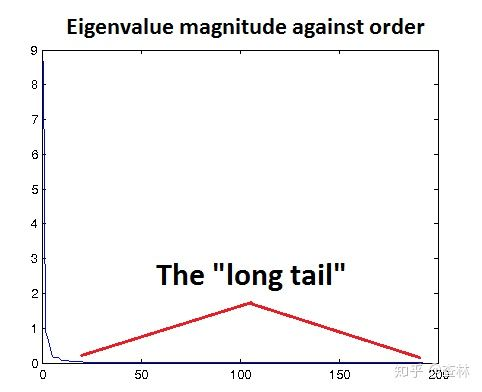

# 图像数据预处理

> 参考知乎：https://zhuanlan.zhihu.com/p/45571839
>
> 作者：查林

图像数据预处理非常必要也非常重要

## 数据归一化

数据预处理中，标准的第一步是数据归一化。虽然这里有一系列可行的方法，但是这一步通常是根据数据的具体情况而明确选择的。特征归一化常用的方法包含如下几种：

- 简单缩放
- 逐样本均值消减(也称为移除直流分量)
- 特征标准化(使数据集中所有特征都具有零均值和单位方差)

### 简单缩放

**在简单缩放中，我们的目的是通过对数据的每一个维度的值进行重新调节（这些维度可能是相互独立的），使得最终的数据向量落在 [0,1] 或 [ − 1,1] 的区间内（根据数据情况而定）。这对后续的处理十分重要，因为很多默认参数（如 PCA-白化中的 epsilon）都假定数据已被缩放到合理区间。**

**Eg:** 在处理自然图像时，我们获得的像素值在 [0,255] 区间中，常用的处理是将这些像素值除以 255，使它们缩放到 [0,1] 中。

### 逐样本均值消减

如果你的数据是*平稳*的（即数据每一个维度的统计都服从相同分布），那么你可以考虑在每个样本上减去数据的统计平均值(逐样本计算)。

**Eg:** 对于图像，这种归一化可以移除图像的平均亮度值 (intensity)。很多情况下我们对图像的照度并不感兴趣，而更多地关注其内容，这时对每个数据点移除像素的均值是有意义的。注意：虽然该方法广泛地应用于图像，但在处理彩色图像时需要格外小心，具体来说，是因为不同色彩通道中的像素并不都存在平稳特性。

### 特征标准化

特征标准化指的是（独立地）使得数据的每一个维度具有零均值和单位方差。这是归一化中最常见的方法并被广泛地使用（例如，在使用支持向量机（SVM）时，特征标准化常被建议用作预处理的一部分）。在实际应用中，特征标准化的具体做法是：首先计算每一个维度上数据的均值（使用全体数据计算），之后在每一个维度上都减去该均值。下一步便是在数据的每一维度上除以该维度上数据的标准差。

**Eg:** 处理音频数据时，常用 Mel 倒频系数 MFCCs 来表征数据。然而MFCC特征的第一个分量（表示直流分量）数值太大，常常会掩盖其他分量。这种情况下，为了平衡各个分量的影响，通常对特征的每个分量独立地使用标准化处理。

### PCA/ZCA 白化

在做完简单的归一化后，白化通常会被用来作为接下来的预处理步骤，它会使我们的算法工作得更好。实际上许多深度学习算法都依赖于白化来获得好的特征。

在进行 PCA/ZCA 白化时，首先使特征零均值化是很有必要的，这保证了
$$\frac{1}{m} \sum_{i} x^{(i)}=0$$

。特别地，这一步需要在计算协方差矩阵前完成。（唯一例外的情况是已经进行了逐样本均值消减，并且数据在各维度上或像素上是平稳的。）

接下来在 PCA/ZCA 白化中我们需要选择合适的 epsilon（回忆一下，这是规则化项，对数据有低通滤波作用）。 选取合适的 epsilon 值对特征学习起着很大作用，下面讨论在两种不同场合下如何选取 epsilon：

#### 基于重构的模型

在基于重构的模型中(包括自编码器，稀疏编码，受限 Boltzman 机（RBM），k-均值（K-Means）)，经常倾向于选取合适的 epsilon 以使得白化达到低通滤波的效果。（译注：通常认为数据中的高频分量是噪声，低通滤波的作用就是尽可能抑制这些噪声，同时保留有用的信息。在 PCA 等方法中，假设数据的信息主要分布在方差较高的方向，方差较低的方向是噪声（即高频分量），因此后文中 epsilon 的选择与特征值有关）。一种检验 epsilon 是否合适的方法是用该值对数据进行 ZCA 白化，然后对白化前后的数据进行可视化。如果 epsilon 值过低，白化后的数据会显得噪声很大；相反，如果 epsilon 值过高，白化后的数据与原始数据相比就过于模糊。一种直观上得到 epsilon 大小的方法是以图形方式画出数据的特征值，如下图的例子所示，你可以看到一条"长尾"，它对应于数据中的高频噪声部分。你需要选取合适的 epsilon，使其能够在很大程度上过滤掉这条"长尾"，也就是说，选取的 epsilon 应大于大多数较小的、反映数据中噪声的特征值。

在基于重构的模型中，损失函数有一项是用于惩罚那些与原始输入数据差异较大的重构结果（译注：以自动编码机为例，要求输入数据经过编码和解码之后还能尽可能的还原输入数据）。如果 epsilon 太小，白化后的数据中就会包含很多噪声，而模型要拟合这些噪声，以达到很好的重构结果。因此，对于基于重构的模型来说，对原始数据进行低通滤波就显得非常重要。

提示：如果数据已被缩放到合理范围（如[0,1]），可以从 $\epsilon = 0.1$ 或 $\epsilon = 0.01$ 开始调节。

#### 基于正交化ICA的模型

对基于正交化ICA的模型来说，保证输入数据尽可能地白化（即协方差矩阵为单位矩阵）非常重要。这是因为：这类模型需要对学习到的特征做正交化，以解除不同维度之间的相关性。因此在这种情况下，epsilon 要足够小（比如 epsilon = 1e − 6 ）。

提示：我们也可以在PCA白化过程中同时降低数据的维度。这是一个很好的主意，因为这样可以大大提升算法的速度（减少了运算量和参数数目）。确定要保留的主成分数目有一个经验法则：即所保留的成分的总方差达到总样本方差的 99% 以上。

注意: 在使用分类框架时，我们应该只基于训练集上的数据计算PCA/ZCA白化矩阵。需要保存以下两个参数留待测试集合使用：(a)用于零均值化数据的平均值向量；(b)白化矩阵。测试集需要采用这两组保存的参数来进行相同的预处理。

#### 大图像

对于大图像，采用基于 PCA/ZCA 的白化方法是不切实际的，因为协方差矩阵太大。在这些情况下我们退而使用 1/f 白化方法。
