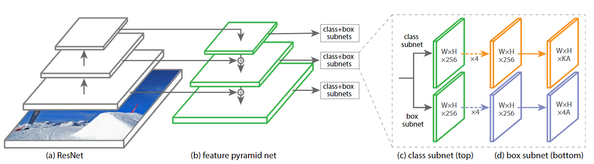
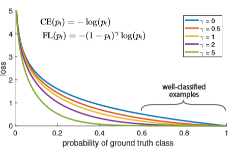
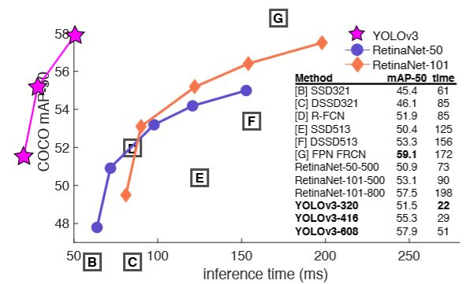

# Retina Net

> 论文地址: <https://arxiv.org/abs/1708.02002>
>
> 论文代码: <https://github.com/facebookresearch/Detectron>

这篇论文主要提出了一种新的 loss 计算方法，该loss可以解决 one-stage 算法中的正负样本的比例严重失衡的问题，不需要改变网络结构，只需要改变损失函数就可以获得很好的效果。

## 算法流程图

RetinaNet 在ResNet网络的基础上使用特征金字塔网络(FPN)来生成丰富的多尺度卷积特征金字塔。RetinaNet在此基础上附加了两个子网络，一个用于对锚框内目标进行分类，另一个子网络用于对锚框位置和大小回归到真实对象框所在的位置与大小。

网络设计刻意简单，这使这项工作能够专注于一种新颖的Focal Loss损失功能，从而消除了One-Stage与最先进的Two-Stage（如带有FPN的Faster R-CNN）之间的精度差距，同时以更快的速度运行。

## Focal Loss

当样本不均衡的时候，如负样本很大，而且很多都是容易分类的（置信度很高的）,这样模型的优化方向就不是我们想要的方向，我是想让正负样本分开的，所以我们要把很多的注意力放在困难、难分类的样本上，所以作者在标准交叉熵损失的基础上进行了改进，首先我们把交叉熵二分类loss定义为：

$$CE (p, y)=\left\{\begin{array}{ll}
-\log (p) & \text { if } y=1 \\
-\log (1-p) & \text { otherwise }
\end{array}\right.$$

然后 $y \epsilon\{-1,1\}$ 表示正负样本的标签， $p$ 表示模型预测 $y = 1$ 的概率，所以我们定义 $p_t$ 如下：

$$p_{ t }=\left\{\begin{array}{ll}
p & \text { if } y=1 \\
1-p & \text { otherwise }
\end{array}\right.$$

然后我们重写交叉熵损失为 $C E(p, y)=C E\left(p_{t}\right)=-\log \left(p_{t}\right)$

- 首先我们要解决样本不平衡的问题，我们使用一个平衡因子 $\alpha_{t}$ ,其范围是0到1，对于类别1乘以 $\alpha_{t}$ ,而对于类别-1乘以 $1 - \alpha_{t}$ ，然后我们把损失函数重写为：

$$CE \left(p_{1}\right)=-\alpha_{ t } \log \left(p_{1}\right)$$

- 虽然上面的方法使得可以调节正负样本对loss的贡献度，但是我们希望那些容易分的样本（置信度高的）提供的loss小一些，而那些难分的样本提供的loss几乎不变化，让分类器优化的方向更关注那些难分的样本。

$$FL \left(p_{ i }\right)=-\left(1-p_{ i }\right)^{\gamma} \log \left(p_{ i }\right)$$

假如有这么一个样本，且 $\gamma = 2$ 时，如果其 $p_t = 0.9$ 时，FL loss 会比原来的 CE loss 小100多倍，如果其 $p_t = 0.968$ ，那就会小1000多倍。

最后我们把完整版的 loss 函数写下来，为：

$$FL \left(p_{ i }\right)=-\alpha_{ i }\left(1-p_{ i }\right)^{\gamma} \log \left(p_{ i }\right)$$

本文中，将 $\gamma$ 定义为2时效果最好！

可以看出，蓝色的线为CE loss, 随着 $\gamma$ 的增加，那些容易分类的样本所贡献的loss就越小，所以可以使模型的优化方向更加关注那些难分类的样本，这样就可以提高模型的精度，同时兼顾了速度。

## 算法效果

对于One-Stage算法，使用FL loss要比使用OHEM等平衡正负样本的策略要来的效果好一些。但是有些算法如YOLOV3使用Focal loss效果就没有那么好，可能是算法内就已经平衡了正负样本，所以不适用~~~

## 算法总结

### 优点

- 通过修改loss函数实现处理了正负样本不均衡的问题

- 分析了One-Stage算法和Two Stage算法的差距，实现了一个精度可以媲美Two Stage算法的One Stage算法模型--RetinaNet

### 缺点

- 可以通过YOLOV3文章的图，知道，其速度仍然是问题

