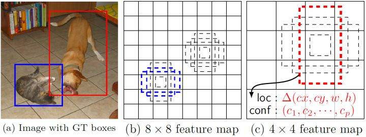

# SSD

## 前言

目标检测近年来已经取得了很重要的进展，主流的算法主要分为两个类型（参考 [RefineDet](https://arxiv.org/pdf/1711.06897.pdf)）：（1）**two-stage** 方法，如R-CNN系算法，其主要思路是先通过启发式方法（selective search）或者 CNN 网络（RPN）产生一系列稀疏的候选框，然后对这些候选框进行分类与回归，two-stage 方法的优势是准确度高；（2）**one-stage** 方法，如 Yolo 和 SSD，其主要思路是均匀地在图片的不同位置进行密集抽样，抽样时可以采用不同尺度和长宽比，然后利用 CNN 提取特征后直接进行分类与回归，整个过程只需要一步，所以其优势是速度快，但是均匀的密集采样的一个重要缺点是训练比较困难，这主要是因为正样本与负样本（背景）极其不均衡（参见[Focal Loss](./RetinaNet.md)），导致模型准确度稍低。不同算法的性能如图1所示，可以看到两类方法在准确度和速度上的差异。

本文讲解的是 SSD 算法，其英文全名是 Single Shot MultiBox Detector，名字取得不错，Single shot 指明了 SSD 算法属于 one-stage 方法，MultiBox 指明了 SSD 是多框预测。在上一篇文章中我们已经讲了 [Yolo](./YOLOv1.md) 算法，从图 1 也可以看到，SSD 算法在准确度和速度（除了 SSD512）上都比 Yolo 要好很多。图 2 给出了不同算法的基本框架图，对于 Faster R-CNN，其先通过 CNN 得到候选框，然后再进行分类与回归，而 Yolo 与 SSD 可以一步到位完成检测。相比 Yolo，SSD 采用 CNN 来直接进行检测，而不是像 Yolo 那样在全连接层之后做检测。其实采用卷积直接做检测只是 SSD 相比 Yolo 的其中一个不同点，另外还有两个重要的改变，一是 SSD 提取了不同尺度的特征图来做检测，大尺度特征图（较靠前的特征图）可以用来检测小物体，而小尺度特征图（较靠后的特征图）用来检测大物体；二是 SSD 采用了不同尺度和长宽比的先验框（Prior boxes, Default boxes，在 Faster R-CNN 中叫做锚框，Anchors）。Yolo 算法缺点是难以检测小目标，而且定位不准，但是这几点重要改进使得 SSD 在一定程度上克服这些缺点。下面我们详细讲解 SDD 算法的原理。

## 设计理念

SSD 和 Yolo 一样都是采用一个 CNN 网络来进行检测，但是却采用了多尺度的特征图，其基本架构如图3所示。下面将 SSD 核心设计理念总结为以下三点：

### (1) 采用多尺度特征图用于检测

所谓多尺度采用大小不同的特征图，CNN 网络一般前面的特征图比较大，后面会逐渐采用 stride=2 的卷积或者 pool 来降低特征图大小，这正如图 3 所示，一个比较大的特征图和一个比较小的特征图，它们都用来做检测。这样做的好处是比较大的特征图来用来检测相对较小的目标，而小的特征图负责检测大目标，如图 4 所示，8x8 的特征图可以划分更多的单元，但是其每个单元的先验框尺度比较小。

### （2）采用卷积进行检测

与 Yolo 最后采用全连接层不同，SSD 直接采用卷积对不同的特征图来进行提取检测结果。对于形状为 $m \times n \times p$ 的特征图，只需要采用 $3 \times 3 \times p$ 这样比较小的卷积核得到检测值。

### （3）设置先验框

在 Yolo 中，每个单元预测多个边界框，但是其都是相对这个单元本身（正方块），但是真实目标的形状是多变的，Yolo 需要在训练过程中自适应目标的形状。而 SSD 借鉴了 Faster R-CNN 中 anchor 的理念，每个单元设置尺度或者长宽比不同的先验框，预测的边界框（bounding boxes）是以这些先验框为基准的，在一定程度上减少训练难度。一般情况下，每个单元会设置多个先验框，其尺度和长宽比存在差异，如图5所示，可以看到每个单元使用了 4 个不同的先验框，图片中猫和狗分别采用最适合它们形状的先验框来进行训练，后面会详细讲解训练过程中的先验框匹配原则。

SSD 的检测值也与 Yolo 不太一样。对于每个单元的每个先验框，其都输出一套独立的检测值，对应一个边界框，主要分为两个部分。第一部分是各个类别的置信度或者评分，值得注意的是 SSD 将背景也当做了一个特殊的类别，如果检测目标共有 $c$ 个类别，SSD 其实需要预测 $c+1$ 个置信度值，其中第一个置信度指的是不含目标或者属于背景的评分。后面当我们说 $c$ 个类别置信度时，请记住里面包含背景那个特殊的类别，即真实的检测类别只有 $c-1$ 个。在预测过程中，置信度最高的那个类别就是边界框所属的类别，特别地，当第一个置信度值最高时，表示边界框中并不包含目标。第二部分就是边界框的 location，包含4个值 $(cx, cy, w, h)$ ，分别表示边界框的中心坐标以及宽高。但是真实预测值其实只是边界框相对于先验框的转换值(paper 里面说是 offset，但是觉得 transformation 更合适，参见[R-CNN](https://arxiv.org/abs/1311.2524) )。先验框位置用 $d=\left(d^{c x}, d^{c y}, d^{w}, d^{h}\right)$ 表示，其对应边界框用 $b=\left(b^{c x}, b^{c y}, b^{w}, b^{h}\right)$ 表示，那么边界框的预测值 $l$ 其实是 $b$ 相对于 $d$ 的转换值：

$$l^{c x}=\left(b^{c x}-d^{c x}\right) / d^{w}, l^{c y}=\left(b^{c y}-d^{c y}\right) / d^{h}$$
$$l^{w}=\log \left(b^{w} / d^{w}\right), l^{h}=\log \left(b^{h} / d^{h}\right)$$

习惯上，我们称上面这个过程为边界框的编码（encode），预测时，你需要反向这个过程，即进行解码（decode），从预测值 $l$ 中得到边界框的真实位置 $b$

$$b^{c x}=d^{w} l^{c x}+d^{c x}, b^{c y}=d^{y} l^{c y}+d^{c y}$$

$$b^{w}=d^{w} \exp \left(l^{w}\right), b^{h}=d^{h} \exp \left(l^{h}\right)$$

然而，在SSD的[Caffe](https://github.com/weiliu89/caffe/tree/ssd)源码实现中还有trick，那就是设置variance超参数来调整检测值，通过bool参数variance_encoded_in_target来控制两种模式，当其为True时，表示variance被包含在预测值中，就是上面那种情况。但是如果是False（大部分采用这种方式，训练更容易？），就需要手动设置超参数variance，用来对 $l$ 的4个值进行放缩，此时边界框需要这样解码：

$$b^{c x}=d^{w}\left(\text {variance}[0] * l^{c x}\right)+d^{c x}, b^{c y}=d^{y}\left(\text {variance}[1] * l^{c y}\right)+d^{c y}$$

$$b^{w}=d^{w} \exp \left(\text {variance}[2] * l^{w}\right), b^{h}=d^{h} \exp \left(\text {variance}[3] * l^{h}\right)$$

综上所述，对于一个大小 $m \times n$ 的特征图，共有 $mn$ 个单元，每个单元设置的先验框数目记为 $k$ ，那么每个单元共需要 $(c+4)k$ 个预测值，所有的单元共需要 $(c+4)kmn$ 个预测值，由于SSD采用卷积做检测，所以就需要 $(c+4)k$ 个卷积核完成这个特征图的检测过程。

## 网络结构

SSD 采用 VGG16 作为基础模型，然后在 VGG16 的基础上新增了卷积层来获得更多的特征图以用于检测。SSD的网络结构如图 6 所示。上面是 SSD 模型，下面是 Yolo 模型，可以明显看到 SSD 利用了多尺度的特征图做检测。模型的输入图片大小是 $300 \times 300$ （还可以是 $512 \times 512$ ，其与前者网络结构没有差别，只是最后新增一个卷积层，本文不再讨论）。

采用 VGG16 做基础模型，首先 VGG16 是在 ILSVRC CLS-LOC 数据集预训练。然后借鉴了 DeepLab-LargeFOV，分别将 VGG16 的全连接层 fc6 和 fc7 转换成 $3 \times 3$ 卷积层 conv6 和 $1 \times 1$ 卷积层conv7，同时将池化层 pool5 由原来的 stride=2 的 $2 \times 2$ 变成 stride=1 的 $3 \times 3$ （猜想是不想reduce特征图大小），为了配合这种变化，采用了一种 Atrous Algorithm，其实就是 conv6 采用扩展卷积或空洞卷积（Dilation Conv），其在不增加参数与模型复杂度的条件下指数级扩大卷积的视野，其使用扩张率(dilation rate)参数，来表示扩张的大小，如下图 7 所示，(a) 是普通的 $3 \times 3$ 卷积，其视野就是 $3 \times 3$ ，(b) 是扩张率为2，此时视野变成 $7 \times 7$ ，(c) 扩张率为4时，视野扩大为 $15 \times 15$ ，但是视野的特征更稀疏了。Conv6 采用 $3 \times 3$ 大小但 dilation rate=6 的扩展卷积。

然后移除 dropout 层和 fc8 层，并新增一系列卷积层，在检测数据集上做 finetuing。

其中 VGG16 中的 Conv4_3 层将作为用于检测的第一个特征图。conv4_3 层特征图大小是 $38 \times 38$ ，但是该层比较靠前，其 norm 较大，所以在其后面增加了一个 L2 Normalization 层，以保证和后面的检测层差异不是很大，这个和 Batch Normalization 层不太一样，其仅仅是对每个像素点在 channle 维度做归一化，而 Batch Normalization 层是在 [batch_size, width, height] 三个维度上做归一化。归一化后一般设置一个可训练的放缩变量 $\gamma$。