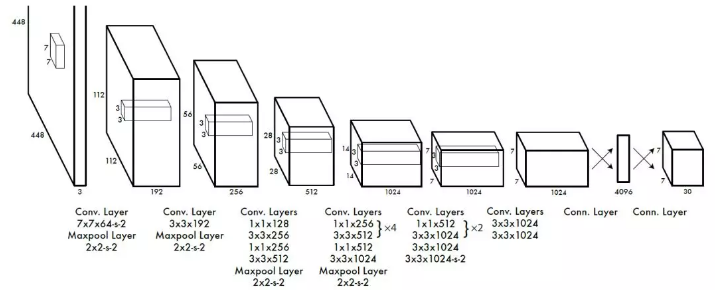

# YOLO 的发展历程（V1）

## YOLOv1

YOLOv1是 Ross Girshick 针对目标检测速度问题提出的另外一种框架。YOLO V1 的增强版本在 GPU 上能跑 45fps，简化版本 155fps。

> 论文下载：<http://arxiv.org/abs/1506.02640>  
> 代码下载：<https://github.com/pjreddie/darknet>

### 1. YOLO 的核心思想

- YOLO 的核心思想就是利用整张图作为网络的输入，直接在输出层回归 bounding box （边界框）的位置及其所属的类别。
- faster-RCNN 中也直接用整张图作为输入，但是 faster-RCNN 整体还是采用了 RCNN 那种 proposal + classifier 的思想，只不过是将提取 proposal的步骤放在 CNN 中实现了， 而 YOLO 则采用直接回归的思路。

### 2. YOLO 的实现方法

将一副图像分成 S x S 个网格（grid cell），如果某个 Object 的中心落在这个网格中，则这个网络就复制预测这个 object。

每个网格要预测 B 个 bounding box，每个 bounding box 除了要回归自身的位置之外，还要附带预测一个 confidence 值。

这个 confidence 代表了所预测的 box 中含有 object 的置信度和这个 box 预测的有多准这两重信息，其值是这样计算的：  
$$Pr(Object) * IOU_{pred}^{truth} $$
其中如果有 object 落在一个 grid cell 里，第一项取 1，否则取 0。 第二项是预测的 bounding box 和实际的 groundtruth 之间的 IoU 值。

每个 bounding box 要预测 (x, y, w, h) 和 confidence 共5个值，每个网格还要预测一个类别信息，记为 C 类。则 SxS个 网格，每个网格要预测 B 个 bounding box 还要预测 C 个 categories。输出就是 S x S x (5*B+C) 的一个 tensor。

注意：class 信息是针对每个网格的，confidence 信息是针对每个 bounding box 的。

举例说明: 在 PASCAL VOC 中，图像输入为 448x448，取 S=7，B=2，一共有20 个类别（C=20），则输出就是 7x7x30 的一个 tensor。

整个网络结构如下图所示：

在 test 的时候，每个网格预测的 class 信息和 bounding box 预测的 confidence信息相乘，就得到每个 bounding box 的 class-specific confidence score:
$$Pr(Class_i | Object) * Pr(Object) * IOU_{pred}^{truth} = Pr(Class_i) * IOU_{pred}^{truth}$$
等式左边第一项就是每个网格预测的类别信息，第二、三项就是每个 bounding box 预测的 confidence。这个乘积即 encode 了预测的 box 属于某一类的概率，也有该 box 准确度的信息。

得到每个 box 的 class-specific confidence score 以后，设置阈值，滤掉得分低的 boxes，对保留的 boxes 进行 NMS 处理，就得到最终的检测结果。

> 注：
>
> * 由于输出层为全连接层，因此在检测时，YOLO 训练模型只支持与训练图像相同的输入分辨率。
>  
> * 虽然每个格子可以预测 B 个 bounding box，但是最终只选择只选择 IOU 最高的 bounding box 作为物体检测输出，即每个格子最多只预测出一个物体。当物体占画面比例较小，如图像中包含畜群或鸟群时，每个格子包含多个物体，但却只能检测出其中一个。这是 YOLO 方法的一个缺陷。

### 3. YOLO 的实现细节

每个 grid 有 30 维，这 30 维中，8 维是回归 box 的坐标，2 维是 box的 confidence，还有 20 维是类别。 

其中坐标的 x, y 用对应网格的 offset 归一化到 0-1 之间，w, h 用图像的 width 和 height 归一化到 0-1 之间。

在实现中，最主要的就是怎么设计损失函数，让这个三个方面得到很好的平衡。作者简单粗暴的全部采用了 sum-squared error loss 来做这件事。

这种做法存在以下几个问题：  

- 8维的 localization error 和20维的 classification error 同等重要显然是不合理的；

- 如果一个网格中没有 object（一幅图中这种网格很多），那么就会将这些网格中的 box 的 confidence push 到 0，相比于较少的有 object 的网格，这种做法是 overpowering 的，这会导致网络不稳定甚至发散。

解决办法：

- 更重视8维的坐标预测，给这些损失前面赋予更大的 loss weight, 记为在 pascal VOC 训练中取 5。

- 对没有 object 的 box 的 confidence loss，赋予小的 loss weight，记为在 pascal VOC 训练中取 0.5。

- 有 object 的 box 的 confidence loss 和类别的 loss 的 loss weight 正常取 1。

- 对不同大小的 box 预测中，相比于大 box 预测偏一点，小 box 预测偏一点肯定更不能被忍受的。而 sum-square error loss 中对同样的偏移 loss 是一样。

- 为了缓和这个问题，作者用了一个比较取巧的办法，就是将 box 的 width 和 height 取平方根代替原本的 height 和 width。这个参考下面的图很容易理解，小box 的横轴值较小，发生偏移时，反应到y轴上相比大 box 要大。（也是个近似逼近方式）

一个网格预测多个 box，希望的是每个 box predictor 专门负责预测某个 object。具体做法就是看当前预测的 box 与 ground truth box 中哪个 IoU 大，就负责哪个。这种做法称作 box predictor 的 specialization。

最后整个的损失函数如下所示： 

这个损失函数中：

- 只有当某个网格中有 object 的时候才对 classification error 进行惩罚。

- 只有当某个 box predictor 对某个 ground truth box 负责的时候，才会对 box 的 coordinate error 进行惩罚，而对哪个 ground truth box 负责就看其预测值和 ground truth box 的 IoU 是不是在那个 cell 的所有 box 中最大。

其他细节，例如使用激活函数使用 leak RELU，模型用 ImageNet 预训练等等，在这里就不一一赘述了。

> 注：
>
> * YOLO 方法模型训练依赖于物体识别标注数据，因此，对于非常规的物体形状或比例，YOLO 的检测效果并不理想。
>
>* YOLO 采用了多个下采样层，网络学到的物体特征并不精细，因此也会影响检测效果。
>
> * YOLO 的损失函数中，大物体 IOU 误差和小物体 IOU 误差对网络训练中 loss 贡献值接近（虽然采用求平方根方式，但没有根本解决问题）。因此，对于小物体，小的 IOU 误差也会对网络优化过程造成很大的影响，从而降低了物体检测的定位准确性。

### 4. YOLO 的缺点

YOLO 对相互靠的很近的物体，还有很小的群体检测效果不好，这是因为一个网格中只预测了两个框，并且只属于一类。

同一类物体出现的新的不常见的长宽比和其他情况时，泛化能力偏弱。

由于损失函数的问题，定位误差是影响检测效果的主要原因。尤其是大小物体的处理上，还有待加强。