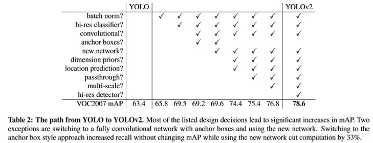
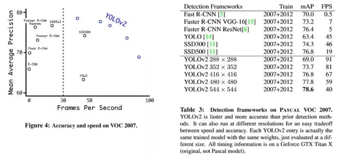

# YOLO v2

YOLOv2：代表着目前业界最先进物体检测的水平，它的速度要快过其他检测系统（FasterR-CNN，ResNet，SSD），使用者可以在它的速度与精确度之间进行权衡。

YOLO9000：这一网络结构可以实时地检测超过 9000 种物体分类，这归功于它使用了 WordTree，通过 WordTree 来混合检测数据集与识别数据集之中的数据。

> 工程代码地址：<http://pjreddie.com/darknet/yolo>
> 
> YOLO9000: Better, Faster, Stronger

## 简介

目前的检测数据集（Detection Datasets）有很多限制，分类标签的信息太少，图片的数量小于分类数据集（Classification Datasets），而且检测数据集的成本太高，使其无法当作分类数据集进行使用。而现在的分类数据集却有着大量的图片和十分丰富分类信息。

文章提出了一种新的训练方法–联合训练算法。这种算法可以把这两种的数据集混合到一起。使用一种分层的观点对物体进行分类，用巨量的分类数据集数据来扩充检测数据集，从而把两种不同的数据集混合起来。

联合训练算法的基本思路就是：同时在检测数据集和分类数据集上训练物体检测器（Object Detectors ），用检测数据集的数据学习物体的准确位置，用分类数据集的数据来增加分类的类别量、提升鲁棒性。

YOLO9000 就是使用联合训练算法训练出来的，他拥有 9000 类的分类信息，这些分类信息学习自ImageNet分类数据集，而物体位置检测则学习自 COCO 检测数据集。

> 代码和预训练模型地址：<http://pjreddie.com/yolo9000/>

## 更准

YOLO 一代有很多缺点，作者希望改进的方向是改善 recall，提升定位的准确度，同时保持分类的准确度。

目前计算机视觉的趋势是更大更深的网络，更好的性能表现通常依赖于训练更大的网络或者把多种模型综合到一起。但是 YOLO v2 则着力于简化网络。具体的改进见下表：

**Batch Normalization**

使用 Batch Normalization 对网络进行优化，让网络提高了收敛性，同时还消除了对其他形式的正则化（regularization）的依赖。通过对 YOLO 的每一个卷积层增加 Batch Normalization，最终使得 mAP 提高了 2%，同时还使模型正则化。使用 Batch Normalization 可以从模型中去掉 Dropout，而不会产生过拟合。

**High resolution classifier**

目前业界标准的检测方法，都要先把分类器（classifier）放在ImageNet上进行预训练。从 Alexnet 开始，大多数的分类器都运行在小于 256\*256 的图片上。而现在 YOLO 从 224\*224 增加到了 448\*448，这就意味着网络需要适应新的输入分辨率。

为了适应新的分辨率，YOLO v2 的分类网络以 448\*448 的分辨率先在 ImageNet上进行微调，微调 10 个 epochs，让网络有时间调整滤波器（filters），好让其能更好的运行在新分辨率上，还需要调优用于检测的 Resulting Network。最终通过使用高分辨率，mAP 提升了 4%。

**Convolution with anchor boxes**

YOLO 一代包含有全连接层，从而能直接预测 Bounding Boxes 的坐标值。  Faster R-CNN 的方法只用卷积层与 Region Proposal Network 来预测 Anchor Box 偏移值与置信度，而不是直接预测坐标值。作者发现通过预测偏移量而不是坐标值能够简化问题，让神经网络学习起来更容易。

所以最终 YOLO 去掉了全连接层，使用 Anchor Boxes 来预测 Bounding Boxes。作者去掉了网络中一个池化层，这让卷积层的输出能有更高的分辨率。收缩网络让其运行在 416\*416 而不是 448\*448。由于图片中的物体都倾向于出现在图片的中心位置，特别是那种比较大的物体，所以有一个单独位于物体中心的位置用于预测这些物体。YOLO 的卷积层采用 32 这个值来下采样图片，所以通过选择 416\*416 用作输入尺寸最终能输出一个 13\*13 的特征图。 使用 Anchor Box 会让精确度稍微下降，但用了它能让 YOLO 能预测出大于一千个框，同时 recall 达到88%，mAP 达到 69.2%。

**Dimension clusters**

之前 Anchor Box 的尺寸是手动选择的，所以尺寸还有优化的余地。 为了优化，在训练集的 Bounding Boxes 上跑一下 k-means聚类，来找到一个比较好的值。

如果我们用标准的欧式距离的 k-means，尺寸大的框比小框产生更多的错误。因为我们的目的是提高 IOU 分数，这依赖于 Box 的大小，所以距离度量的使用：

$$d\text{(box,centroid)} = 1 - \text{IOU(box,centroid)}$$

通过分析实验结果（Figure 2），左图：在模型复杂性与 high recall 之间权衡之后，选择聚类分类数 K=5。右图：是聚类的中心，大多数是高瘦的 Box。

通过分析实验结果（Figure 2），左图：在模型复杂性与 high recall 之间权衡之后，选择聚类分类数 K=5。右图：是聚类的中心，大多数是高瘦的 Box。

**Direct location prediction**

用 Anchor Box 的方法，会让 model 变得不稳定，尤其是在最开始的几次迭代的时候。大多数不稳定因素产生自预测 Box 的（x,y）位置的时候。按照之前 YOLO的方法，网络不会预测偏移量，而是根据 YOLO 中的网格单元的位置来预测坐标，这就让 Ground Truth 的值介于 0 到 1 之间。而为了让网络的结果能落在这一范围内，网络使用一个 Logistic Activation 来对于网络预测结果进行限制，让结果介于 0 到 1 之间。 网络在每一个网格单元中预测出 5 个 Bounding Boxes，每个 Bounding Boxes 有五个坐标值 tx，ty，tw，th，t0，他们的关系见下图（Figure3）。假设一个网格单元对于图片左上角的偏移量是 cx、cy，Bounding Boxes Prior 的宽度和高度是 pw、ph，那么预测的结果见下图右面的公式：

因为使用了限制让数值变得参数化，也让网络更容易学习、更稳定。Dimension clusters和Direct location prediction，使 YOLO 比其他使用 Anchor Box 的版本提高了近5％。

**Fine-Grained Features**

YOLO 修改后的特征图大小为 13\*13，这个尺寸对检测图片中尺寸大物体来说足够了，同时使用这种细粒度的特征对定位小物体的位置可能也有好处。Faster-RCNN、SSD 都使用不同尺寸的特征图来取得不同范围的分辨率，而 YOLO 采取了不同的方法，YOLO 加上了一个 Passthrough Layer 来取得之前的某个 26\*26 分辨率的层的特征。这个 Passthrough layer 能够把高分辨率特征与低分辨率特征联系在一起，联系起来的方法是把相邻的特征堆积在不同的 Channel 之中，这一方法类似与 Resnet 的 Identity Mapping，从而把 26\*26\*512 变成 13\*13\*2048。YOLO 中的检测器位于扩展后（expanded ）的特征图的上方，所以他能取得细粒度的特征信息，这提升了 YOLO 1% 的性能。

**Multi-Scale Training**

作者希望 YOLOv2 能健壮地运行于不同尺寸的图片之上，所以把这一想法用于训练模型中。

区别于之前的补全图片的尺寸的方法，YOLOv2 每迭代几次都会改变网络参数。每 10 个 Batch，网络会随机地选择一个新的图片尺寸，由于使用了下采样参数是  32，所以不同的尺寸大小也选择为 32 的倍数 {320，352…..608}，最小 320\*320，最大 608\*608，网络会自动改变尺寸，并继续训练的过程。

这一政策让网络在不同的输入尺寸上都能达到一个很好的预测效果，同一网络能在不同分辨率上进行检测。当输入图片尺寸比较小的时候跑的比较快，输入图片尺寸比较大的时候精度高，所以你可以在 YOLOv2 的速度和精度上进行权衡。

下图是在 voc2007 上的速度与精度

## 更快

YOLO 使用的是 GoogLeNet 架构，比 VGG-16 快，YOLO 完成一次前向过程只用 85.2 亿次运算，而 VGG-16 要 306.9 亿次，但是 YOLO 精度稍低于 VGG-16。

**Darknet19**

YOLO v2 基于一个新的分类模型，有点类似于 VGG。YOLO v2 使用 3*3 的 filter，每次池化之后都增加一倍 Channels 的数量。YOLO v2 使用全局平均池化，使用 Batch Normilazation 来让训练更稳定，加速收敛，使模型规范化。

最终的模型–Darknet19，有 19 个卷积层和 5 个 maxpooling 层，处理一张图片只需要 55.8 亿次运算，在 ImageNet 上达到 72.9% top-1 精确度，91.2% top-5 精确度。

**Training for classification**

在训练时，把整个网络在更大的448\*448分辨率上Fine Turnning 10个 epoches，初始学习率设置为0.001，这种网络达到达到76.5% top-1精确度，93.3% top-5精确度。

## 更强

在训练的过程中，当网络遇到一个来自检测数据集的图片与标记信息，那么就把这些数据用完整的 YOLO v2 loss 功能反向传播这个图片。当网络遇到一个来自分类数据集的图片和分类标记信息，只用整个结构中分类部分的 loss 功能反向传播这个图片。

但是检测数据集只有粗粒度的标记信息，像“猫“、“ 狗”之类，而分类数据集的标签信息则更细粒度，更丰富。比如狗这一类就包括”哈士奇“”牛头梗“”金毛狗“等等。所以如果想同时在监测数据集与分类数据集上进行训练，那么就要用一种一致性的方法融合这些标签信息。

再者，用于分类的方法，大多是用 softmax layer 方法，softmax 意味着分类的类别之间要互相独立的。而盲目地混合数据集训练，就会出现比如：检测数据集的分类信息中”狗“这一分类，在分类数据集合中，就会有的不同种类的狗：“哈士奇”、“牛头梗”、“金毛”这些分类，这两种数据集之间的分类信息不相互独立。所以使用一种多标签的模型来混合数据集，假设一个图片可以有多个分类信息，并假定分类信息必须是相互独立的规则可以被忽略。

**Hierarchical classification**

WordNet 的结构是一个直接图表（directed graph），而不是树型结构。因为语言是复杂的，狗这个词既属于‘犬科’又属于‘家畜’两类，而‘犬科’和‘家畜’两类在 WordNet 中则是同义词，所以不能用树形结构。

作者希望根据 ImageNet 中包含的概念来建立一个分层树，为了建立这个分层树，首先检查 ImagenNet 中出现的名词，再在 WordNet 中找到这些名词，再找到这些名词到达他们根节点的路径（在这里设为所有的根节点为实体对象（physical object）。在 WordNet 中，大多数同义词只有一个路径，所以首先把这条路径中的词全部都加到分层树中。接着迭代地检查剩下的名词，并尽可能少的把他们添加到分层树上，添加的原则是取最短路径加入到树中。

为了计算某一结点的绝对概率，只需要对这一结点到根节点的整条路径的所有概率进行相乘。所以比如你想知道一个图片是否是 Norfolk terrier 的概率，则进行如下计算：
$$Pr(\text{Norfolk terrier}) = Pr(\text{Norfolk terrier}| \text{terrier})*$$
$$Pr(\text{terrier}|\text{hunting dog})*$$
$$*...*$$
$$Pr(\text{mammal}|\text{animal}) *$$
$$Pr(\text{animal}|\text{physical object}) $$

为了验证这一个方法，在 WordTree 上训练 Darknet19 的模型，使用 1000 类的 ImageNet 进行训练，为了建立 WordtTree 1K，把所有中间词汇加入到 WordTree 上，把标签空间从 1000 扩大到了 1369。在训练过程中，如果有一个图片的标签是“Norfolk terrier”，那么这个图片还会获得”狗“（dog）以及“哺乳动物”（mammal）等标签。总之现在一张图片是多标记的，标记之间不需要相互独立。

如 Figure5 所示，之前的 ImageNet 分类是使用一个大 softmax 进行分类。而现在，WordTree 只需要对同一概念下的同义词进行 softmax 分类。

使用相同的训练参数，这种分层结构的Darknet19达到71.9%top-1精度和90.4% top-5 精确度，精度只有微小的下降。

这种方法的好处：在对未知或者新的物体进行分类时，性能降低的很优雅（gracefully）。比如看到一个狗的照片，但不知道是哪种种类的狗，那么就高置信度（confidence）预测是”狗“，而其他狗的种类的同义词如”哈士奇“”牛头梗“”金毛“等这些则低置信度。

**Datasets combination with wordtree**

用 WordTree 把数据集合中的类别映射到分层树中的同义词上，例如上图 Figure 6，WordTree 混合 ImageNet 与 COCO。

**Joint classification and detection**

作者的目的是：训练一个 Extremely Large Scale 检测器。所以训练的时候使用 WordTree 混合了 COCO 检测数据集与 ImageNet 中的 Top9000 类，混合后的数据集对应的 WordTree 有 9418 个类。另一方面，由于 ImageNet 数据集太大了，作者为了平衡一下两个数据集之间的数据量，通过过采样（oversampling） COCO 数据集中的数据，使 COCO 数据集与 ImageNet 数据集之间的数据量比例达到 1：4。

YOLO9000 的训练基于 YOLO v2 的构架，但是使用 3 priors 而不是 5 来限制输出的大小。当网络遇到检测数据集中的图片时则正常地反方向传播，当遇到分类数据集图片的时候，只使用分类的 loss 功能进行反向传播。同时作者假设 IOU 最少为 0.3。最后根据这些假设进行反向传播。

使用联合训练法，YOLO9000 使用 COCO 检测数据集学习检测图片中的物体的位置，使用 ImageNet 分类数据集学习如何对大量的类别中进行分类。

为了评估这一方法，使用 ImageNet Detection Task 对训练结果进行评估。

评估结果：

- YOLO9000 取得 19.7 mAP。 在未学习过的 156 个分类数据上进行测试， mAP 达到 16.0。

- YOLO9000 的 mAP 比 DPM 高，而且 YOLO 有更多先进的特征，YOLO9000 是用部分监督的方式在不同训练集上进行训练，同时还能检测 9000个物体类别，并保证实时运行。

虽然 YOLO9000 对动物的识别性能很好，但是对类别为“sungalsses”或者“swimming trunks”这些衣服或者装备的类别，它的识别性能不是很好，见 table 7。这跟数据集的数据组成有很大关系。

## 总结

YOLO v2 代表着目前最先进物体检测的水平，在多种监测数据集中都要快过其他检测系统，并可以在速度与精确度上进行权衡。

YOLO 9000 的网络结构允许实时地检测超过9000种物体分类，这归功于它能同时优化检测与分类功能。使用 WordTree 来混合来自不同的资源的训练数据，并使用联合优化技术同时在 ImageNet 和 COCO 数据集上进行训练，YOLO9000 进一步缩小了监测数据集与识别数据集之间的大小代沟。