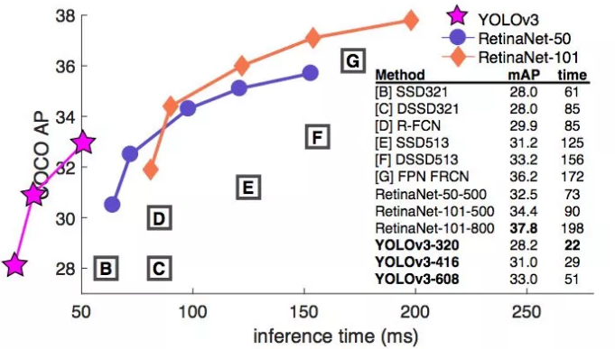
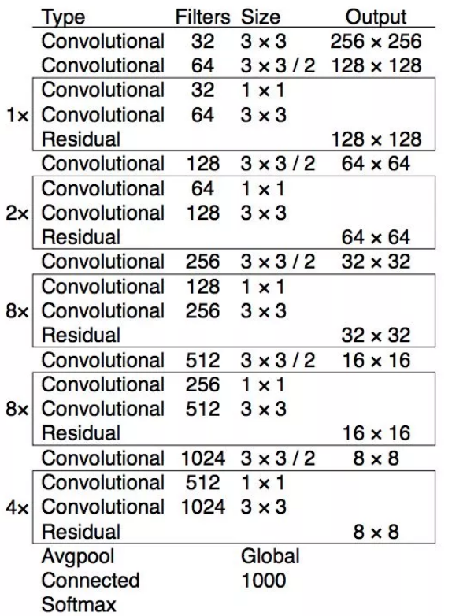
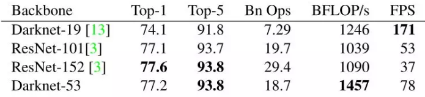
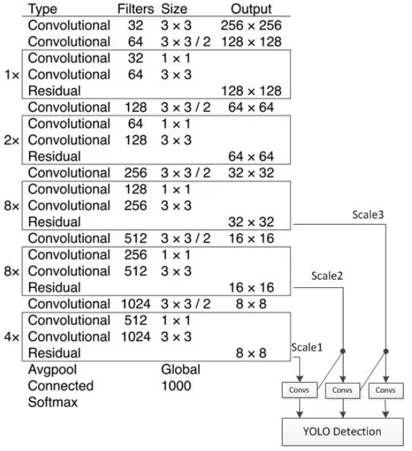
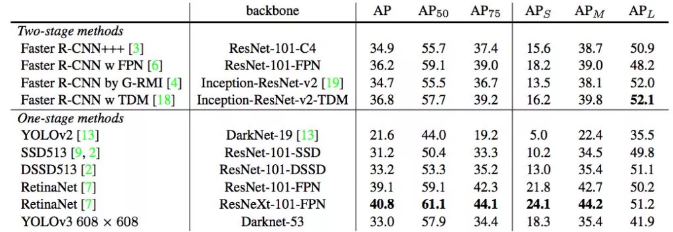

# YOLO v3

> 参考资料
>
> YOLO 主页 <https://pjreddie.com/darknet/yolo/>
>
> YOLOv3: An Incremental Improvement

YOLOv3 在 Pascal Titan X 上处理 608x608 图像速度可以达到 20FPS，在 COCO test-dev 上 mAP@0.5 达到 57.9%，与RetinaNet（FocalLoss论文所提出的单阶段网络）的结果相近，并且速度快 4 倍.

YOLO v3 的模型比之前的模型复杂了不少，可以通过改变模型结构的大小来权衡速度与精度。

速度对比如下：

YOLOv3 在实现相同准确度下要显著地比其它检测方法快。时间都是在采用 M40 或 Titan X 等相同 GPU 下测量的。

简而言之，YOLOv3 的先验检测（Prior detection）系统将分类器或定位器重新用于执行检测任务。他们将模型应用于图像的多个位置和尺度。而那些评分较高的区域就可以视为检测结果。此外，相对于其它目标检测方法，我们使用了完全不同的方法。我们将一个单神经网络应用于整张图像，该网络将图像划分为不同的区域，因而预测每一块区域的边界框和概率，这些边界框会通过预测的概率加权。我们的模型相比于基于分类器的系统有一些优势。它在测试时会查看整个图像，所以它的预测利用了图像中的全局信息。与需要数千张单一目标图像的 R-CNN 不同，它通过单一网络评估进行预测。这令 YOLOv3 非常快，一般它比 R-CNN 快 1000 倍、比 Fast R-CNN 快 100 倍。

改进之处：

1. 多尺度预测 （类FPN）

2. 更好的基础分类网络（类ResNet）和分类器 darknet-53，见下图

3. 分类器-类别预测：

YOLOv3 不使用 Softmax 对每个框进行分类，主要考虑因素有：

1. Softmax 使得每个框分配一个类别（得分最高的一个），而对于 Open Images这种数据集，目标可能有重叠的类别标签，因此 Softmax不适用于多标签分类。

2. Softmax 可被独立的多个 logistic 分类器替代，且准确率不会下降。

3. 分类损失采用 binary cross-entropy loss。

## 多尺度预测

每种尺度预测 3 个 box, anchor 的设计方式仍然使用聚类，得到9个聚类中心，将其按照大小均分给 3 个尺度。

- 尺度1: 在基础网络之后添加一些卷积层再输出box信息。

- 尺度2: 从尺度1中的倒数第二层的卷积层上采样(x2)再与最后一个 16x16 大小的特征图相加，再次通过多个卷积后输出 box 信息，相比尺度1变大两倍。

- 尺度3: 与尺度2类似，使用了 32x32 大小的特征图

### 基础网络 Darknet-53

darknet-53 与 ResNet-101 或 ResNet-152 准确率接近，但速度更快，对比如下：

检测结构如下：

YOLOv3 在 mAP@0.5 及小目标 APs 上具有不错的结果，但随着 IOU的增大，性能下降，说明 YOLOv3 不能很好地与 ground truth 切合。
