# YOLOv4

> YOLOv4在速度和准确率上都十分优异，作者使用了大量的trick，论文也写得很扎实，在工程还是学术上都有十分重要的意义，既可以学习如何调参，也可以了解目标检测的trick。

> 论文: YOLOv4: Optimal Speed and Accuracy of Object Detection <https://arxiv.org/abs/2004.10934>
>
> 代码：<https://github.com/AlexeyAB/darknet>

## 简介

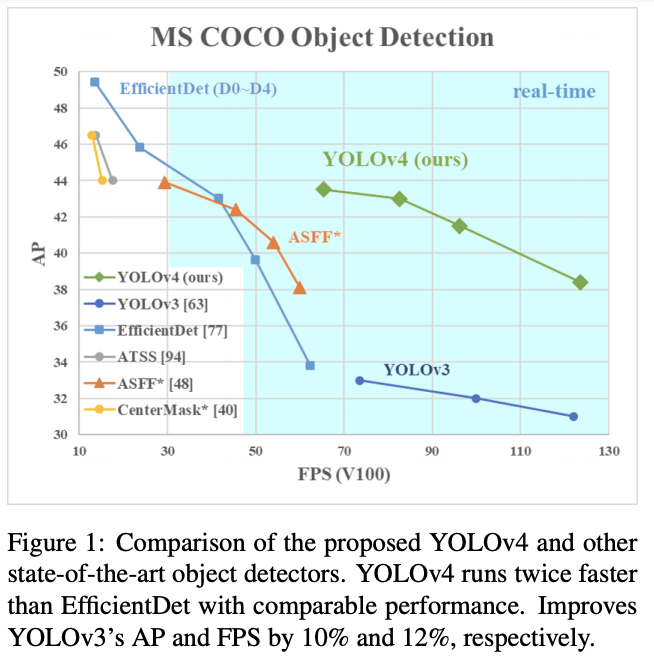

论文提出YOLOv4，从图1的结果来看，相对于YOLOv3在准确率上提升了近10个点，然而速度并几乎没有下降，论文主要贡献如下：

- 提出速度更快、精度更好的检测模型，仅需要单张1080Ti或2080Ti即可完成训练。
- 验证了目前SOTA的Bag-ofFreebies(不增加推理成本的trick)和Bag-of-Specials(增加推理成本的trick)的有效性。
- 修改了SOTA方法，让其更高效且更合适地在单卡进行训练，包括CBN、PAN、SAM等。

## 方法

### Selection of architecture

对检测模型来说，分类最优的主干网络不一定是最合适的，适用于目标检测的主干网络需满足以下要求：

- 高输入分辨率，提高小物体的检测准确率。
- 更多的层，提高感受域来适应输入的增加。
- 更多的参数，提高检测单图多尺寸目标的能力。

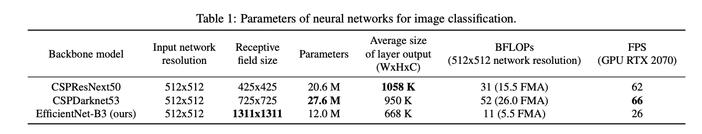

理论来讲，应该选择感受域更大且参数了更大的模型作为主干网络，表1对比了三种SOTA主干网络的，可以看到CSPDarknet53的感受域、参数量以及速度都是最好的，故选其为主干网络。

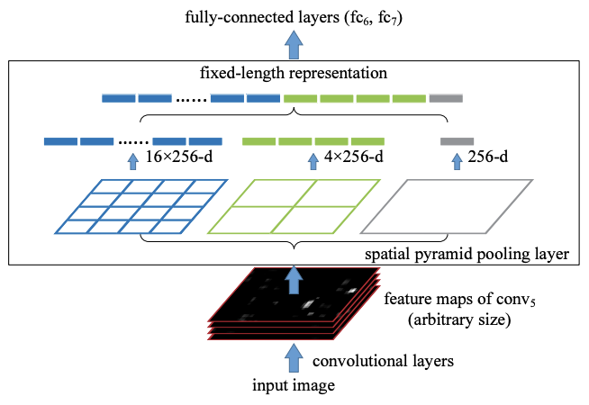

另外，使用不同大小的感受域有以下好处：

- 匹配物体大小，可以观察完整的物体。
- 匹配网络大小，可以观察物体的上下文信息。
- 超过网络的大小，增加点与最终激活之间的连接数。

为此，YOLOv4加入了SPP block，能够显著地改善感受域大小，而且速度几乎没有什么下降。

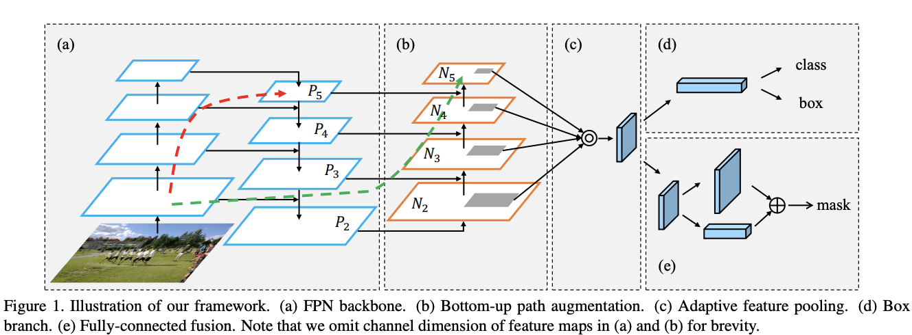

另外，使用PANet替换FPN来进行多通道特征的融合。
最终，YOLOv4选择CSPDarknet53作为主干网络，配合SPP模块，PANet通道融合以及YOLOv3的anchor based head。

### Selection of BoF and BoS

目前比较有效的目标检测提升的trick：

- 激活函数: ReLU, leaky-ReLU, ~~parametric-ReLU, ReLU6, SELU~~, Swish, or Mish。
- bbox回归损失: MSE, IoU, GIoU, CIoU, DIoU
- 数据增强: CutOut, MixUp, CutMix
- 正则化方法: DropOut, DropPath, Spatial DropOut, or **DropBlock**
- 归一化方法: Batch Normalization(BN), ~~Cross-GPU Batch Normalization(CGBN or SyncBN),~~ Filter Response Normalization (FRN), or Cross-Iteration Batch Normalization(CBN)

由于PReLU和SELU难以训练，并且ReLU6是专门为量化网络设计的，从激活函数中去除这几种。而在正则化方法中，DropBlock的效果是最优的。对于归一化方法的选择，由于需要单卡训练，因此不考虑SyncBN。

### Additional improvements

为了让模型能更好地在单卡进行训练，做了以下的改进：

- 提出新的数据增强方法Mosaic和Self-Adversarial Training (SAT)。
- 使用遗传算法选择最优的超参数。
- 修改目前的方法来让训练和检测更有效，包括改进的SAM，改进的PAN以及 Cross mini-Batch Normalization (CmBN)

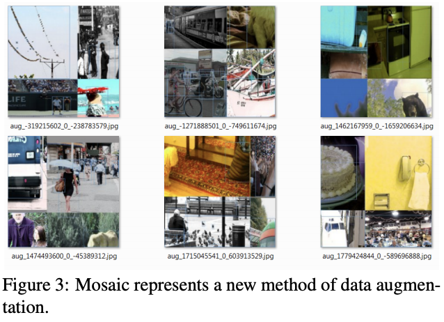

- Mosaic是新的数据增强方法，同时融合4张训练图片，CutMix仅融合2张图片，使得目标的检测范围超出其正常的上下文，另外BN每次统计4张图片，这能显著地减少对大mini-batch的需要。
- Self-Adversarial Training(SAT)也提供新的数据增强手段，分为两个前向反向阶段。在第一阶段，先对图片进行前向计算，然后通过反向传播修改图片的像素，注意这里不修改网络的权重，通过这种方式，网络进行了一次对抗式训练，制造出没有目标的假象。在第二阶段，对修改后的图片进行正常的训练。

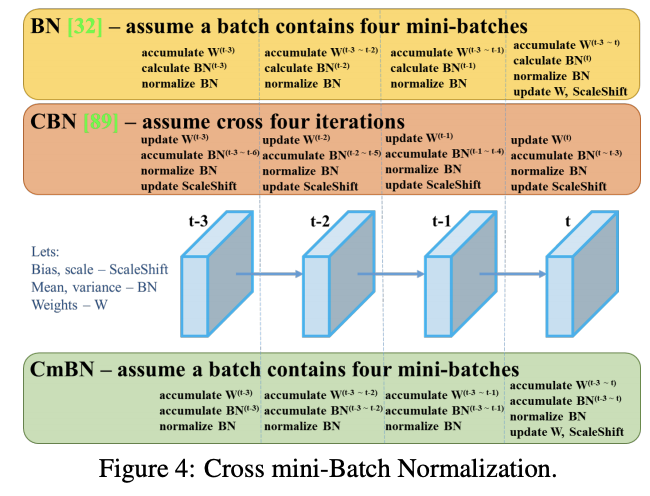

CmBN是改进版的CBN，仅统计single-batch中的mini-batch，如图4所示，假设t-3~t为single-batch中的mini-batch，若干single-batch中包含单个mini-batch，则CmBN与BN一样。

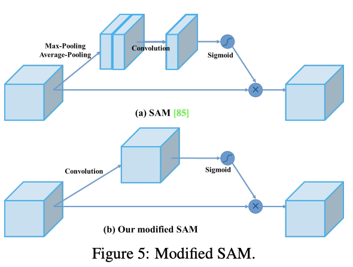

将SAM从spitial-wise attention修改为point-wise attention，即输入和输出的大小一致。

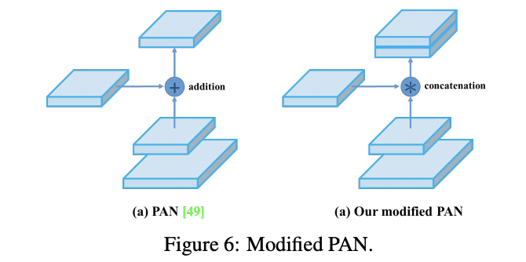

将PAN的shortcut连接方法，从相加改为concate。

### YOLO v4

YOLOv4包含：

- Backbone：CSPDarknet53
- Neck：SPP，PAN
- Head：YOLOv3
YOLO v4使用：

- 主干网络的BoF(Bag of Freebies)：CutMix和Mosaic数据增强, DropBlock正则化, 标签平滑(Class label smoothing)
- 主干网络的BoS(Bag of Specials)：Mish激活, Cross-stage partial connections (CSPNet), Multiinput weighted residual connections(MiWRC)
- 检测端的BoF(Bag of Freebies)：CIoU-loss, CmBN, DropBlock正则化, Mosaic数据增强, Self-Adversarial Training, 去除边框敏感性(Eliminate grid sensitivity，见实验部分的解释), 多anchor回归(之前只选最大的), 余弦退火学习率调整(Cosine annealing scheduler), 使用遗传算法最优化超参数, 随机输入大小
- 检测端的BoS(Bag of Specials)：Mish激活, SPP-block, SAM-block, PAN通道融合, DIoU-NMS

## Experiments

### Influence of different features on Classifier training

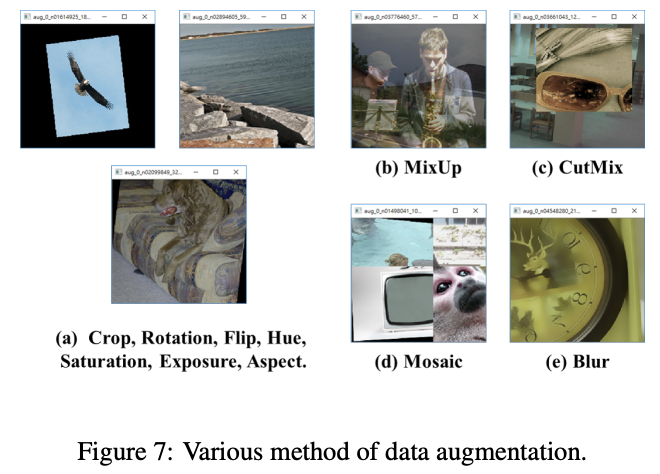

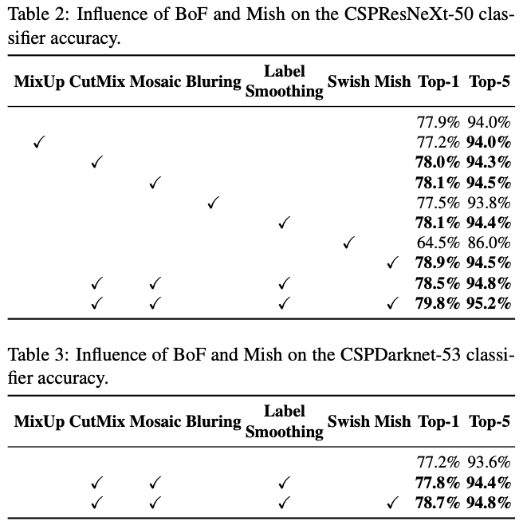

CutMix、Mosaic数据增强和标签平衡(Class label smoothing)比较有效。

### Influence of different features on Detector training

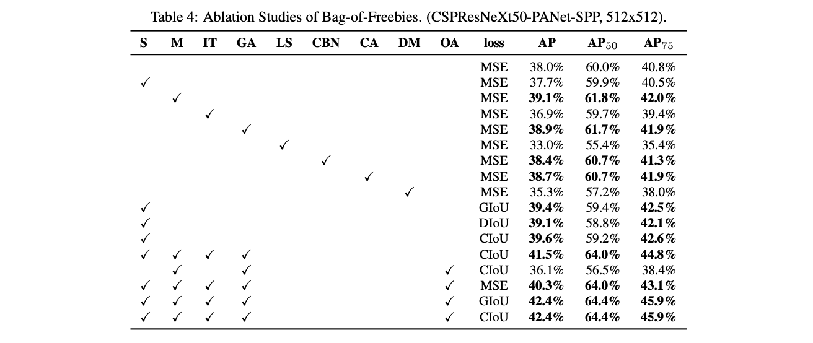

表4对比的BoF如下：

- S：去除边框敏感性，$b_x = \sigma(t_x) + c_x$, 之前的中心的回归与 anchor 的边相关，当需要趋近 $c_x$ 或 $c_x + 1$ 时，需要很大的 $|t_x|$，为此对sigmoid添加一个大于 1 的因子来减少这个影响。
- M：Mosaic数据增强
- IT：IoU阈值，使用大于IoU阈值的anchor进行训练，之前好像只选最大的
- GA：使用遗传算法进行最优超参选择
- LS：标签平滑
- CNB：论文提出的CmBN
- CA：使用余弦退火(Cosine annealing scheduler)进行学习率下降
- DM：动态mini-batch大小，小分辨率时增加mini-batch
- OA：使用最优的anchors
- GIoU, CIoU, DIoU, MSE：bbox损失函数

其他：

论文也对比了检测端的BoS，从结果来看，SPP、PAN和SAM同时使用时效果最好。

论文研究了不同主干网络对检测准确率的影响，可以看到CSPDarknet53能更好地适应各种改进。

论文对比了不同的mini-batch大小下的检测准确率，在加入BoF和BoS训练策略后，mini-batch的改变几乎对准确率没有影响。

从大量的实验对比来看，YOLOv4在速度和准确率上都十分耐看。

## 结论

YOLOv4在速度和准确率上都十分优异，作者使用了大量的trick，论文也写得很扎实，在工程还是学术上都有十分重要的意义，既可以学习如何调参，也可以了解目标检测的trick。