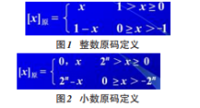
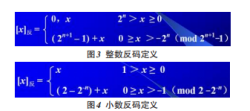
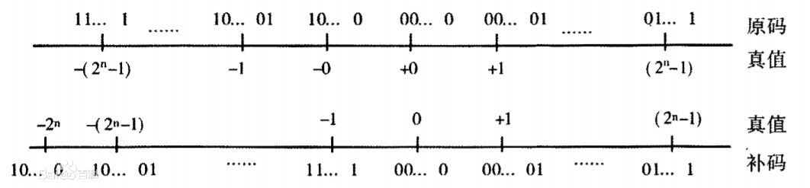

# 原码、反码和补码

在计算机内，定点数有3种表示法：原码、反码和补码。

## 原码

原码（true form）是一种计算机中对数字的二进制定点表示方法。原码表示法在数值前面增加了一位符号位（即最高位为符号位）：正数该位为0，负数该位为1（0有两种表示：+0和-0），其余位表示数值的大小。

### 原码的优点

简单直观；例如，我们用 8 位二进制表示一个数，+11 的原码为 00001011，-11 的原码就是 10001011

### 原码的缺点

原码不能直接参加运算，可能会出错。例如数学上，1+(-1)=0，而在二进制中 00000001 + 10000001 = 10000010，换算成十进制为 -2。显然出错了。
所以原码的符号位不能直接参与运算，必须和其他位分开，这就增加了硬件的开销和复杂性

#### 小数和整数



- 小数原码的定义

    ```cpp
    [x] = X         0 <= X < 1
        = 1 - X     -1 < X <= 0
    ```

    例如：X = +0.1011，[X]原 = 0.1011
    X = -0.1011        [X]原 = 1.1011

- 整数原码的定义

    ```cpp
    [X]原 =
        X                  0 ≤ X < 2 * (n - 1)
        2 * (n - 1) - X    -2 * (n - 1) < X ≤ 0
    ```

    x为正整数时，[X]原=x；
    x为负整数时，[X]原=2的n次方-x；
    x为负小数时，[X]原=1-x；

计算机中所有的数均用0，1编码表示，数字的正负号也不例外，如果一个机器数字长是n位的话，约定最左边一位用作符号位，其余n-1位用于表示数值。

在符号位上用"0"表示正数；用"1"表示负数。数值位表示真值的绝对值。凡不足n-1位的，小数在最低位右边加零；整数则在最高位左边加零以补足n-1位。这种计算机的编码形式叫做原码。

记作X=[X]原。例如在字长n=8的机器内：

小数：

[+0.1011]原=0.1011000

[-0.1011]原=1.1011000

整数：

[+1011]原=00001011

[-1011]原=10001011

代码中的小数点”.”是在书写时为了清晰起见加上去的，在机器中并不出现。

### 编码方式

原码是有符号数的最简单的编码方式，便于输入输出，但作为代码加减运算时较为复杂。一个字长为 n 的机器数能表示不同的数字的个数是固定的$2^n$个，$n=8$时$2^n=256$；用来表示有符号数，数的范围就是 $-2^{(n-1)}$ ~ $2^{(n-1)}-1$，$n=8$时，这个范围就是 $-128$ ~ $+127$。但是在不需要考虑数的正负时，就不需要用一位来表示符号位，n 位机器数全部用来表示是数值，这时表示数的范围就是$0$ ~ $2^n-1$，$n=8$时这个范围就是0~255.没有符号位的数，称为无符号数。

## 反码

反码是数值存储的一种，多应用于系统环境设置，如linux平台的目录和文件的默认权限的设置umask，就是使用反码原理。

反码通常是用来由原码求补码或者由补码求原码的过渡码。根据定义，可以得到机器数的反码的整数和小数中 “0” 的表示形式各有 2 种，“+0” 和 “-0” 不一样，以 8 位机器数为例，整数的 “+0” 原码为 0,0000000，反码为 0,0000000；整数的 “-0” 原码为 1,0000000，反码为 1,1111111；小数的 “+0” 原码为 0.0000000，反码为 0.0000000；小数的 “-0” 原码为 1.0000000，小数的 “-0” 反码为 1.1111111。反码跟原码是正数时，一样；负数时，反码就是原码符号位除外，其他位按位取反。



### 转换

由于正数的原码、补码、反码表示方法均相同，不需转换。
在此，仅以负数情况分析。

#### （1） 已知原码，求补码

例：已知某数X的原码为10110100B，试求X的补码和反码。

解：由[X]原=10110100B知，X为负数。求其反码时，符号位不变，数值部分按位求反；求其补码时，再在其反码的末位加1。

1 0 1 1 0 1 0 0 原码

1 1 0 0 1 0 1 1 反码

符号位不变，数值位取反，即其补码为 11001011+1=11001100

1 1 0 0 1 1 0 0 补码

故：[X]补=11001100B，[X]反=11001101B。

### （2） 已知补码，求原码

分析：按照求负数补码的逆过程，数值部分应是最低位减1，然后取反。但是对二进制数来说，先减1后取反和先取反后加1得到的结果是一样的，故仍可采用取反加 1 方法。

例：已知某数X的补码11101110B，试求其原码。

解：由[X]补=11101110B知，X为负数。

采用逆推法

1 1 1 0 1 1 1 0 补码

1 1 1 0 1 1 0 1 反码（末位减1）

1 0 0 1 0 0 1 0 原码（符号位不变，数值位取反）

## 补码

在计算机系统中，数值一律用补码来表示和存储。原因在于，使用补码，可以将符号位和数值域统一处理；同时，加法和减法也可以统一处理。

### 概念引入

在介绍补码概念之前，先介绍一下“模”的概念：“模”是指一个计量系统的计数范围，如过去计量粮食用的斗、时钟等。计算机也可以看成一个计量机器，因为计算机的字长是定长的，即存储和处理的位数是有限的，因此它也有一个计量范围，即都存在一个“模”。如：时钟的计量范围是0~11，模=12。表示n位的计算机计量范围是$0$ ~ $2^n - 1$，模$=2^n$ ．“模”实质上是计量器产生“溢出”的量，它的值在计量器上表示不出来，计量器上只能表示出模的余数。任何有模的计量器，均可化减法为加法运算。

假设当前时针指向8点，而准确时间是6点，调整时间可有以下两种拨法：一种是倒拨2小时，即 $8-2=6$；另一种是顺拨10小时，$8+10=12+6=6$，即$8-2=8+10=8+12-2(mod 12)$．在12为模的系统里，加10和减2效果是一样的，因此凡是减2运算，都可以用加10来代替。若用一般公式可表示为：$a-b=a-b+mod=a+mod-b$。对“模”而言，2和10互为补数。实际上，以12为模的系统中，11和1，8和4，9和3，7和5，6和6都有这个特性，共同的特点是两者相加等于模。对于计算机，其概念和方法完全一样。n位计算机，设 $n=8$，所能表示的最大数是$11111111$，若再加$1$成$100000000$(9位)，但因只有8位，最高位1自然丢失。又回到了 $00000000$，所以8位二进制系统的模为 $2^8$。在这样的系统中减法问题也可以化成加法问题，只需把减数用相应的补数表示就可以了。把补数用到计算机对数的处理上，就是补码。

### 性质



以补码定义式为基础，沿数轴列出典型的真值、原码与补码表示，可清楚了解补码的有关性质。

- 在补码表示中，最高位 $X_0$ (符号位)表示数的正负，在形式上与原码相同，即 0正 1负。但补码的符号位是数值的一部分，由补码定义式计算而得。例如，负小数补码中 $X_0$ 为 1，这个 1 是真值 $X$ (负)加模 2后产生。

- 在补码表示中，数 0 只有一种表示，[+0] 补 = [-0] 补 = 0.000……0。

- 负数补码表示的范围比原码稍宽，多一种数码组合。对于定点数，若为纯小数，表示范围为：$-1$ ~ $1 - 2^{-n}$，若为纯整数，表示范围为：$-2^n$ ~ $2^n - 1$。

### 意义

补码“模”概念的引入、负数补码的实质、以及补码和真值之间的关系所揭示的补码符号位所具有的数学特征，无不体现了补码在计算机中表示数值型数据的优势，和原码、反码等相比可表现在如下方面：

- 解决了符号的表示的问题；

- 可以将减法运算转化为补码的加法运算来实现，克服了原码加减法运算繁杂的弊端，可有效简化运算器的设计；

- 在计算机中，利用电子器件的特点实现补码和真值、原码之间的相互转换，非常容易；

- 补码表示统一了符号位和数值位，使得符号位可以和数值位一起直接参与运算，这也为后面设计乘法器除法器等运算器件提供了极大的方便。总之，补码概念的引入和当时运算器设计的背景不无关系，从设计者角度，既要考虑表示的数的类型(小数、整数、实数和复数)、数值范围和精确度，又要考虑数据存储和处理所需要的硬件代价。因此，使用补码来表示机器数并得到广泛的应用，也就不难理解
